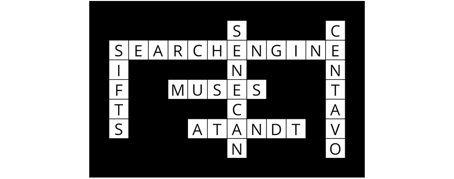

# CrosswordGeneratorCSP

This repository shows the software made in relation to the [third project exercise](https://cs50.harvard.edu/ai/2020/projects/3/crossword/) of [Harvard's CS50 Introduction to Artficial Intelligence](https://cs50.harvard.edu/ai/2020/). The goal of the project is to create a crossword puzzle. Given the structure of the crossword puzzle and a given list of solution words, the problem consists of deciding which words fit into each vertical and horizontal sequence of squares. This type of problem is modeled as a CSP (Constraint Satisfaction Problem). Here, each sequence of squares is a variable for which it must be decided which possible words fit into that sequence.

## Usage

```bash
python3 generate.py data/structure.txt data/words.txt output.png
```

Currently, words from [the New York Times crossword database](https://www.kaggle.com/darinhawley/new-york-times-crossword-clues-answers-19932021) are available, as well as three different structures. An image with the generated puzzle can optionally be saved in PNG format.

## Output and Performance

To test the performance, three different puzzles were generated, of which the time of the algorithm was measured. 

<p align="center"> First crossword puzzle: ~3.9s </p>

<<<<<<< HEAD


<p align="center"> Second crossword puzzle: ~6.5s </p>


<p align="center"> Third crossword puzzle: ~25.6s </p>

=======
<p align="center"> First crossword puzzle: ~3.9s </p>


<p align="center"> Second crossword puzzle: ~6.5s </p>


<p align="center"> Third crossword puzzle: ~25.6s </p>
>>>>>>> 3c1306ee62bb733042352f6b79206a4d62da0c6c


## Algorithms

### Unary constraints

The unary conditions control the value of a single variable of the CSP.
All values that do not meet the unary constraints of a variable can be removed from the domain of the variable. Node consistency is achieved when, for each variable, each value in its domain is consistent with the variable's unary constraints. 

The unary constraint for a variable is given by the length or the number of letters of the word.  Also, the condition that all words must be different is added.  In terms of the crossword puzzle, each value in the domain of a variable has the same number of letters as the length of the variable.

### Binary constraints
The binary conditions control links between two variables. The arc-consistency reduces the search space for a CSP by removing unsupported values from the domains of the variables. The [AC3 algorithm](https://de.wikipedia.org/wiki/AC-3-Algorithmus) is used to enforce and ensure the arc consistency of the problem. This way the binary constraints are fulfilled. Two variables are arc-consistent if each value in the range of one has a possible value in the range of the other that does not cause a conflict. 

In the context of the crossword puzzle, a conflict occurs in a square where two variables disagree on which character value to take. 

### Backtracking DFS
Backtracking is used as a problem solving method to correctly complete the crossword puzzle. If constraints on the selection of the value are not met, a backtrack occurs. If all nodes have been traversed, there is no solution for word combinations. Otherwise, the solution is found during the DFS.

To assign the most constrained variable first, the variable with the minimum remaining value (MRV) is chosen. In case of a tie, the variable with the highest degree is preferred.

